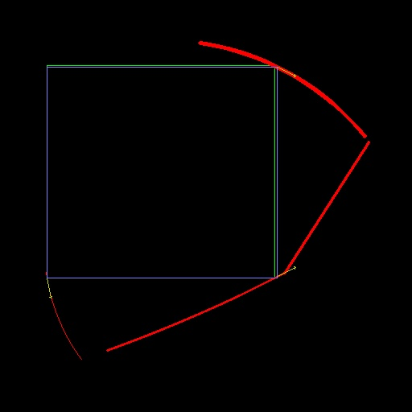
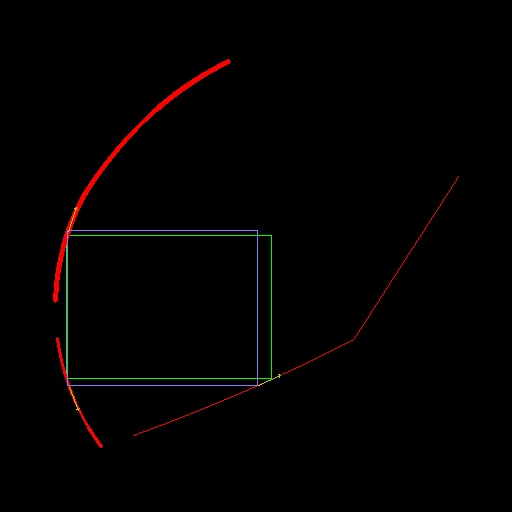
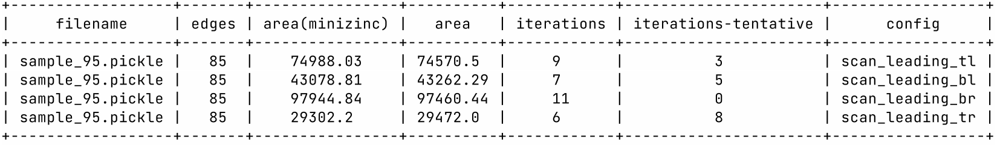

# Fixed point prune-and-search & tentative search algorithms to solve simple geometry tasks

[^Bibliography:]: Computing the largest inscribed isothetic rectangle J. Snoeyink ~1995. Tentative Prune-and-Search .. J. Snoeyink 1995. Fixed point theorem and its applications Alfred Tarski 1955.

## Repository description:

## Theoretical part

#### Definitions

Given n continuous(or piecewise) monotonic functions, defined on the interval [0,1] and takes values also in [0,1]. Let's start with n = 2:

$$
y = f(x), x \subseteq [0,1]
;
x = g(y), y \subseteq [0,1]
$$

##### Additional requirement 1

Functions are set only “speculatively”. Those, tabulation and interpolation to obtain an arbitrary $y=f(x)$ is not expected. This condition is due to the fact that an algorithm based on interpolation and tabulation will require guaranteed >N steps to calculate. Where N is the number of discretization points.

Functions can be defined as space elements:

$$
\Im^{\Lambda }(x,y) \overset{def}{=} \Lambda(x,y,\lambda)
$$

where $\lambda$ is some logical expression on the elements

##### Let's say we have Task:

<u>Find a fixed point of the composition of these functions, if the number of decreasing functions in the composition is odd</u>

$$
\begin{matrix}
f\left (  g\left ( a \right ) \right )= a
\\
a \in \textrm{dom} \left ( f \right ) 
\overset{\underset{\mathrm{def}}{}}{=} A
\\
c 
\in \textrm{dom} \left ( g \right ) \overset{\underset{\mathrm{def}}{}}{=} B
\end{matrix}
$$

------

##### Hypothesis 1:

For n = 2, one can write out exactly the truth table of discarding intervals. 

An example[**Table 1**] for monotonically increasing and monotonically decreasing combination of (f,g):

| Compare result (f,g) | A $\triangledown$ | A $\triangle$ | B $\triangledown$ | B $\triangle$ |
| -------------------- | ----------------- | ----- | ----- | ----- |
| (1,1)                | 0                 | 0     | 0     | 1     |
| (1,0)                | 1                 | 0     | 0     | 0     |
| (0,1)                | 0                 | 1     | 0     | 0     |
| (0,0)                | 0                 | 0     | 1     | 0     |

Meaning of $\triangledown$ and $\triangle$ is moving to lower or upper interval parts

##### Problem solving for n = 2

Let

$$
x_{1},x_{2} \subseteq [0,1];
y_{1},y_{2} \subseteq [0,1];
y = f(x)
$$

A strictly monotonic function is given by a logical equation:

$$
\Im_{1}^{+}(x,y): (x_{0} > x_{1} \to y_{0} > y_{1}) \wedge (x_{0} < x_{1} \to y_{0} < y_{1}) \wedge (x_{0} = x_{1} \to y_{0} = y_{1}) = true
$$

for monotonically increasing and

$$
\Im_{1}^{-}(x,y): (x_{0} > x_{1} \to y_{0} < y_{1}) \wedge (x_{0} < x_{1} \to y_{0} > y_{1}) \wedge (x_{0} = x_{1} \to y_{0} = y_{1}) = true
$$

for a monotonically decreasing function.

The superscript $\Im^{\circ}$ denotes the type of monotonic function (increasing or decreasing), +/-  respectively.

Let's write the result of comparing function values in the form
f(a) > c, a = 0.5, c = 0.5:

$$
\Im_{2}^{>+}(x,y): (x_{i} \geq 0.5 \to y_{i} > 0.5) \wedge (y_{i} \leq 0.5 \to x_{i} < 0.5 )=true
$$

Here, in addition, the superscript denotes the inequality sign > / <

f(a) < c:

$$
\Im_2^{<+}(x,y): (x_{i} \leq 0.5 \to y_{i} < 0.5) \wedge (y_{i} \geq 0.5 \to x_{i} > 0.5) = true
$$

for monotonically increasing and

f(a) > c:

$$
\Im_{2}^{>-}(x,y): (x_{i} \leq 0.5 \to y_{i}>0.5) \wedge (y_{i} \leq 0.5 \to x_{i} > 0.5)=true
$$

f(a) < c:

$$
\Im_{2}^{<-}(x,y): (x_{i} \geq 0.5 \to y_{i} < 0.5) \wedge ( y_{i} \geq 0.5 \to x_{i} < 0.5)=true
$$

for a monotonically decreasing function.

Let us set the conditions for being in half-intervals:

$$
\begin{matrix}
 & \Im_{\underline{3}}(x): x_{i} \leq 0.5 = b_{x}^{0} & 
\Im_{\overline{3}}(x): x_{i} \geq 0.5 = b_{x}^{1}
\end{matrix}
$$

Where $b_{t}^{i}$ are boolean variables

The following condition must be met to reach a solution:

##### Condition A

$$
\Im_{A}: max(z_{i}) - min(z_{i}) \geq 0.5 \to 
\left(max(x_{i}) - min(x_{i}) > 0.5\right) \vee 
\left(max(y_{i}) - min(y_{i}) > 0.5\right)
$$

------

##### Statement 1

Table 1 can be obtained as a solution of the maximum problem:

$$
maximize \sum_{ \omega \in { x,y,z } } 
(b_{\omega}^{0} + b_{\omega}^{1} ) 
$$

Under constraints: 

$$
\begin{matrix}
 \Im_{2}^{\circ }(x,y) \\
 \Im_{2}^{\circ }(y,z) \\
 \Im_{A} \\
 \Im_{\underline{3}}( \omega )  \\
 \Im_{\overline{3}}( \omega )   \\
 \sum_{ i \in { 0,1 } } b_{\omega}^{i} < 2 \\
 b_{z}^{i} = b_{x}^{i}
\end{matrix}
$$

Function setup $\Im_{2}^{\circ }(x,y)$, $\Im_{2}^{\circ }(y,z)$ in case of n = 2 could be:

| f                | g                |
| ---------------- | ---------------- |
| $\Im_{2}^{+}(x,y)$ | $\Im_{2}^{-}(y,z)$ |
| $\Im_{2}^{-}(x,y)$ | $\Im_{2}^{+}(y,z)$ |

------

## Practical part

#### Calculating 2-corner rectangle

Algorithm part for 2-corner rectangle calculation (compute_largest_inscribed_isothetic_rectangle)

Linear programming algorithm re-use (evaluation_compute_largest_inscribed_isothetic_rectangle__lp)

Comparative results:

Iterations are calculated for 2 configs, so estimated iteration number for finding 2 corners rectangle is:

- Calculate extreme points $\approx$  4log(N), N is number of vertexes in convex polygon
- Calculate 2-corners rectangle for 2 configs $\approx$  2log(N/2)
- Testing is it realy inscribed rectangle(is_point_in_convex_polygon) $\approx$  8log(N), can be reduced to 4log(N) to check only opposite diagonal 
- So, totaly it's about 10log(N)

#### Calculating 3-corner rectangle

Comparative result with "handmade" minizinc code ( [./minizinc/triangle-in-convex.mzn](./minizinc/triangle-in-convex.mzn))

analogically, we calculate the complexity of the algorithm:

- Calculate extreme points $\approx$  4log(N), N is number of vertexes in convex polygon
- Calculate 3-corners rectangle for 4 configs $\approx$  4log(N/4)
- Testing is it realy inscribed rectangle(is_point_in_convex_polygon) $\approx$  4log(N) , for only 1 point per-config testing
- Together 2-3 corners search: $\approx$  <u>16log(N)</u> (2+4 configs)

